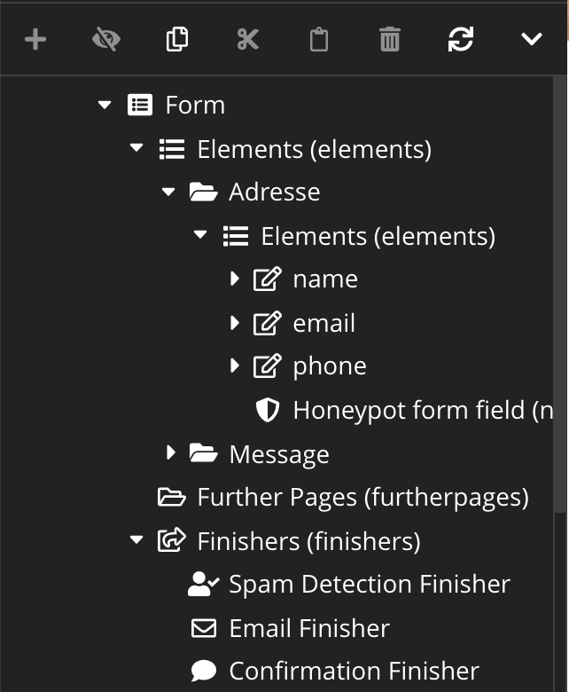
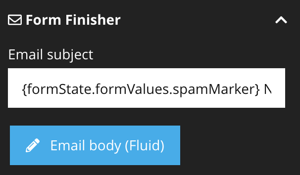
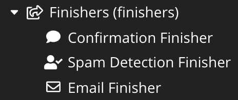

# Honeypot Field for Neos.Form.Builder

  

This package adds an HoneypotField element, which can be used within your forms. This element is rendered
hidden and should never be filled out by a real form user. 

A spam detection finisher checks if the form contains such honeypot fields. If any of that fields are 
filled out, additional field values are introduced which can be used in the following finishers to handle spam.  

## Installation 

    composer require dl/honeypotformfield
    
## Usage

1. Add honeypot form fields (at least one - as many as you like)
2. Add the Spam detection finisher before the finishers, that should use the spam markers.

The finisher adds the following new formFields to the formState:

| FieldName                   | Value                                                         |
|-----------------------------|---------------------------------------------------------------|
| spamDetected                | bool true / false when the submitted form is detected as spam |
| spamMarker                  | Contains `[SPAM]` if detected. Can be used in eMails          |
| spamFilledOutHoneypotFields | Contains the filled honeypot fields                           |

### Mark sent mails as spam

These fields can then be used for example to mark mails as spam:

### Cancel mail sending on spam detection

When the `cancelSubsequentFinishersOnSpamDetection` setting is set to `true`, subsequent finishers are not executed
when the form was detected as spam.

Here the confirmation message is shown but mail sending is cancelled.
